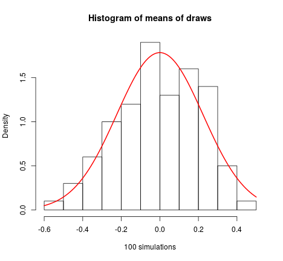
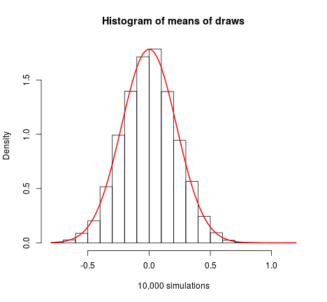

## The Central Limit Theorem

The Central Limit Theorem (**CLT**) postulates that the mean of samples of independent and identically distributed (**IID**) random variables of known distribution are approximately distributed as normal IID variables with mean equal to the mean of the original distribution and variance equal to the variance of the distribution divided by the size of each sample: 

$$x \sim N(\mu, \frac{\sigma ^ 2}{n})$$
where $\mu$ is the mean of the distribution, $\sigma ^ 2$ its variance and $n$ the size of the sample.

NB: the code for this presentation can be found [here](https://github.com/ricardoZmestre/CLTslides/tree/gh-pages).

--- .class #id 

## The exercise

The Shiny application [here](https://ricardozmestre.shinyapps.io/clt1) illustrates the CLT for three different distributions and three different number of draws. The distributions are the normal one, the exponential one and the binomial one; the number of draws are 100, 1,000 and 10,000.

In all cases, for simplicity, the size of each simulated sample is 20. The higher the number of draws, the better the means of the draws approximate a normal distribution.

### Procedure

The chosen distribution and sample size is simulated for as many times as the chosen number of draws, and the mean is calculated for each draw, giving as many means as number of draws. This set of means should be distributed approximately as a normal.

To see plots illustrating the CLT, open the application and click on the second tab on the right ("Distribution of means (CLT)").

To see the meaning of input parameters for the distributions, go to the rightmost tab ("Further details").

---

## The underlying distributions

The parameters to input depend on the underlying distribution.

For the normal distribution, the mean $\mu$ and the standard error $\sigma$ are needed.

For the exponential distribution, a parameter $\lambda$ is needed, indicating the rate of decay in the probability of an event occuring as time goes by. The corresponding mean and standard error are both $\frac{1}{\lambda}$.

For the binomial distribution, two parameters are needed: the number of instances the random variable has been observed (the size), $n$, and the probability of a given event happening, $p$. The corresponding mean and standard error are $n p$ and $\sqrt{n p (1 - p)}$, respectively.

NB: The standard error of the simulated means are the given standard errors divided by $\sqrt{n}$.

---

## Example with normal distribution 

The chart shows 100 and 10,000 means from samples of 20 normal $N(0,1)$ random variables, against the PDF of their theoretical $N(0,\frac{1}{\sqrt{20}})$, in red.

  

